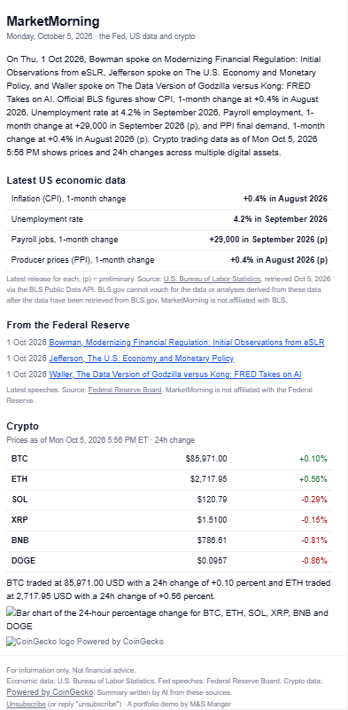
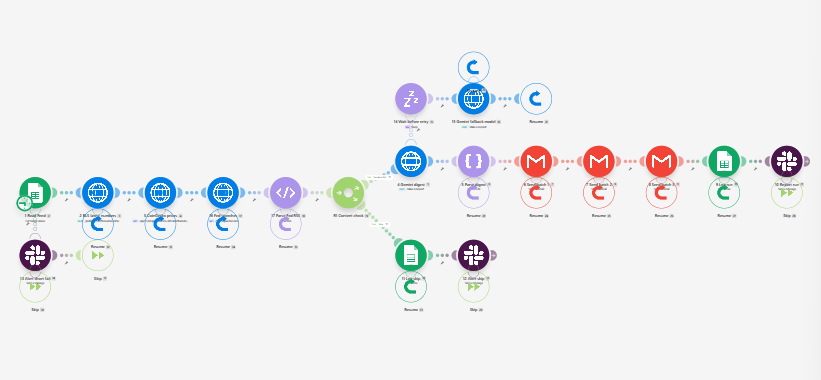
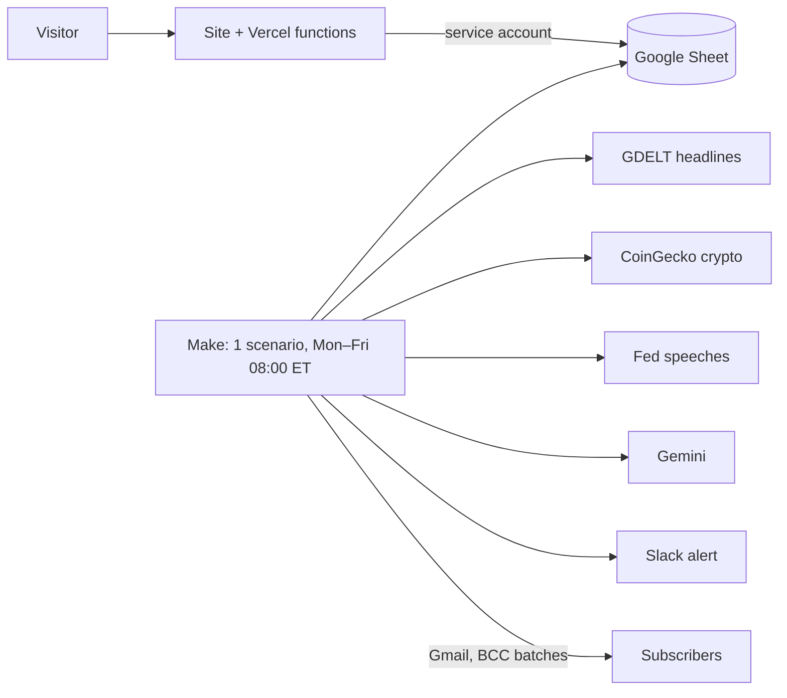

# MarketMorning

**A daily AI market digest built on Make.com, for $0.**
> Portfolio demo by M&S Manger. For information only. Not financial advice.

**Try it live:** [media-and-software-manger.vercel.app](https://media-and-software-manger.vercel.app/#marketmorning)

## The problem
People who follow US markets and crypto want a two-minute answer to "what happened, and why does it matter?" before work. Apps are noisy, newsletters are paid, and AI summaries often make up numbers.

## What it does
Every weekday at 08:00 New York time, one email reaches every subscriber:
- a 3-sentence AI summary of the last 24 hours of market news,
- the two stories that matter most, each with one sentence on why,
- crypto prices and 24-hour moves (BTC, ETH, SOL, XRP, BNB, DOGE) with a bar chart and an "as of" time,
- the top headlines with links, and the latest Federal Reserve speeches.

**Licensed data only.** No free stock-data API allows its prices to be shown to other people, so the digest never shows stock prices. It covers stocks through news. Crypto prices come from CoinGecko, headlines from GDELT and Fed speeches from the Federal Reserve's public-domain feed, all credited in every email. The AI writes sentences only: it picks stories by number, never writes links, and never sees subscriber data. If the AI fails, a plain digest still goes out.

 <!-- screenshot placeholder -->
 <!-- screenshot placeholder -->
 <!-- screenshot placeholder -->

## Architecture

- **Signup:** double opt-in, signed expiring links, honeypot and rate limit. It runs on Vercel, writes to the Sheet, and never uses Make credits.
- **Digest:** one Make scenario makes one news call, one crypto call, one Fed feed call and one Gemini call (plus one retry on a lighter model if it fails), then sends up to 3 BCC batches. That is 12 credits on a normal run and 15 in the worst case, so at most 345 a month.
- **Limits:** the 300-subscriber cap comes from Gmail's 500 recipients per day. People who sign up after that go on a waitlist and are promoted automatically.
- **Local preview:** `node tools/preview-digest.mjs --sample` renders the exact email for 0 credits.

Details: [PRD](docs/PRD.md) · [Architecture](docs/ARCHITECTURE.md) · [Data licensing](docs/DATA-SOURCES.md) · [Sheet](docs/SHEET.md) · [Build order](docs/BUILD-ORDER.md)

## Tech stack
Make.com (Free) · Google Sheets · Gemini API (free tier, structured output) · GDELT DOC 2.0 API · CoinGecko API (Demo) · Federal Reserve RSS · QuickChart · Gmail · Vercel serverless functions (Node) · Slack

## Notes
- Headlines from [The GDELT Project](https://www.gdeltproject.org/). Crypto data [powered by CoinGecko](https://www.coingecko.com/en/api). Fed speeches: Federal Reserve Board.
- This is a portfolio demo, not a financial product. Nothing here is investment advice.
- The repo contains no secrets or real subscriber data.
