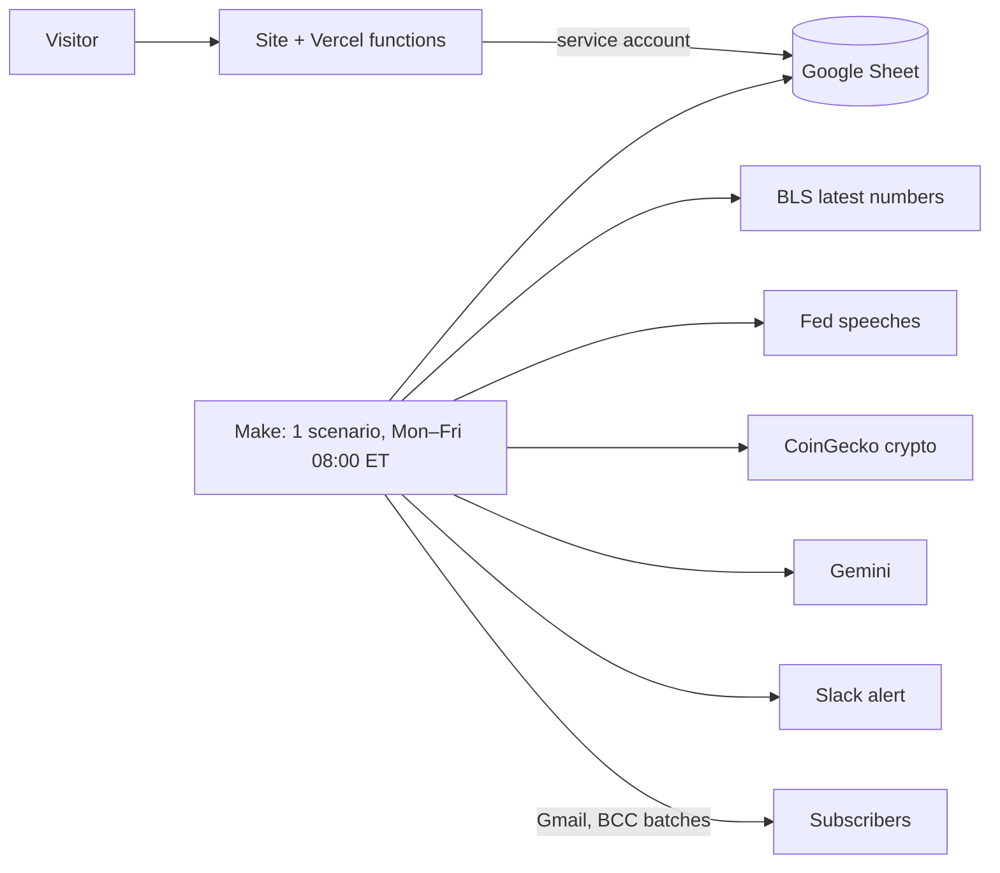

# MarketMorning

**A daily AI brief on the Fed, US economic data and crypto, built on Make.com for $0.**
> Portfolio demo by M&S Manger. For information only. Not financial advice.

**Try it live:** [media-and-software-manger.vercel.app](https://media-and-software-manger.vercel.app/#marketmorning)

## The problem
People who follow the economy and crypto want a two-minute, trustworthy answer to "what's the Fed saying, what do the latest numbers say, and where is crypto?" before work. Apps are noisy, newsletters are paid, and AI summaries often make up numbers.

## What it does
Every weekday at 08:00 New York time, one email reaches every subscriber:
- a 3-sentence AI summary,
- the **latest official US data** from the Bureau of Labor Statistics: inflation (CPI), the unemployment rate, payroll jobs and producer prices, each with its month,
- the **latest Federal Reserve speeches**, dated and linked,
- **crypto** prices and 24-hour moves (BTC, ETH, SOL, XRP, BNB, DOGE), with a chart and an "as of" time.

**Licensed and reliable data only.** I researched free stock-data and news APIs: none allow their data to be shown to other people, and the one open news API (GDELT) was unreachable from every network I tested. So the brief uses public-domain government data (BLS, the Fed) and CoinGecko's attribution-licensed crypto prices, each credited in every email.

Numbers come from the sources, never from the AI. If the AI fails, a plain brief still goes out, and its footer says so. If a source fails, only its own section disappears.

 <!-- screenshot placeholder -->
 <!-- screenshot placeholder -->
 <!-- screenshot placeholder -->

## Architecture

- **Signup:** double opt-in, signed expiring links, honeypot and rate limit. It runs on Vercel, writes to the Sheet, and never uses Make credits.
- **Brief:** one Make scenario reads three official or licensed feeds and makes one Gemini call. A lighter model retries if that call fails. It then sends up to 3 BCC batches. That is 13 credits on a normal run and 16 in the worst case, so at most 368 a month.
- **Limits:** the 300-subscriber cap comes from Gmail's 500 recipients per day. People who sign up after that go on a waitlist and are promoted automatically.
- **Local preview:** `node tools/preview-digest.mjs --sample` renders the exact email for 0 credits.

Details: [PRD](docs/PRD.md) · [Architecture](docs/ARCHITECTURE.md) · [Data licensing](docs/DATA-SOURCES.md) · [Sheet](docs/SHEET.md) · [Build order](docs/BUILD-ORDER.md) · [Maia build guide](docs/MAIA-PROMPTS.md)

## Tech stack
Make.com (Free) · Google Sheets · Gemini API (free tier, structured output) · BLS and Federal Reserve RSS · CoinGecko API (Demo) · QuickChart · Gmail · Vercel serverless functions (Node) · Slack

## Notes
- Economic data: U.S. Bureau of Labor Statistics. Fed speeches: Federal Reserve Board. MarketMorning is not affiliated with either. Crypto data [powered by CoinGecko](https://www.coingecko.com/en/api).
- This is a portfolio demo, not a financial product. Nothing here is investment advice.
- The repo contains no secrets or real subscriber data.
