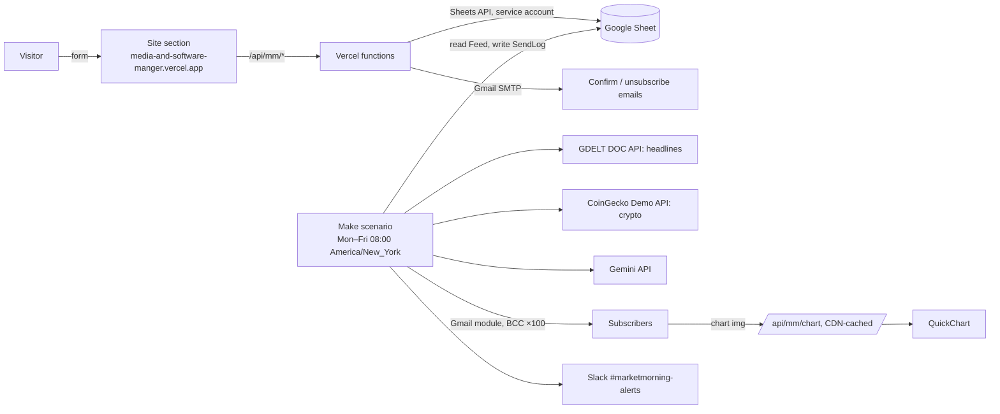
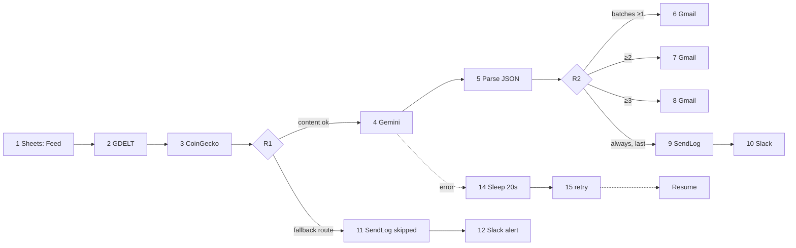

# MarketMorning architecture

Portfolio demo, not financial advice. Sheet: [SHEET.md](SHEET.md). Data licensing: [DATA-SOURCES.md](DATA-SOURCES.md). Build steps and checks: [BUILD-ORDER.md](BUILD-ORDER.md).

## 1. System

No stock prices anywhere: no free stock source licenses display to third parties (DATA-SOURCES.md). Signups never touch Make. Gemini and Slack never receive subscriber data; Make reads only the BCC lists.

## 2. Make scenario (one scenario; create modules in ID order)

Schedule: **Weekdays (Mon–Fri), 08:00**, organization time zone **America/New_York** (DST-aware; runs on market holidays too). Create modules 1–12 first, then the error-route modules with fixed IDs: **13** = Slack alert on module 1's error route, **14** = Tools › Sleep, **15** = Gemini retry, **16** = JSON › Create JSON (only if check C6 fails). Scenario settings: **Data is confidential: on**, max cycles 1. HTTP modules 2, 3, 4, 15: **Evaluate all states as errors: Yes**. `ARTS` = `ifempty(2.data.articles; emptyarray)`, written out inline (Make has no free named variables).

| ID | Module | Key settings and mappings | Error handler | Credits |
|---|---|---|---|---|
| 1 | Google Sheets › Get range values | `Feed!A1:L2`, table contains headers: Yes | 13 Slack "MarketMorning FAILED: Sheet read: {{error.message}}" → **Ignore** (no SendLog: Sheet down) | 1 (+1) |
| 2 | HTTP › Make a request | GET `{{1.gdelt_url}}`, parse response: Yes, timeout 30 s | **Resume**, `data` empty | 1 |
| 3 | HTTP › Make a request | GET `https://api.coingecko.com/api/v3/simple/price?ids=bitcoin,ethereum,solana,ripple,binancecoin,dogecoin&vs_currencies=usd&include_24hr_change=true&include_last_updated_at=true`; API-key keychain "CoinGecko" (header `x-cg-demo-api-key`); parse: Yes; timeout 30 s | **Resume**, `data` empty | 1 |
| R1 | Router | Route A filter: `1.send_enabled` = `TRUE` (text) **and** (`length(ARTS)` > 0 **or** `3.data.bitcoin.usd` exists). Route B = fallback route | – | 0 |
| 4 | HTTP › Make a request | POST `https://generativelanguage.googleapis.com/v1beta/models/{{1.gemini_model}}:generateContent`; keychain "Gemini" (header `x-goog-api-key`); raw body = `prompts/gemini-body.make.txt` (generated, §3.2); parse: Yes; timeout 60 s | 14 Tools › Sleep 20 s → **15** (clone of 4) → **Resume** with `data` = `{{15.data}}`; 15's handler: **Resume**, `data` empty | 1 (+2) |
| 5 | JSON › Parse JSON | `{{ifempty(4.data.candidates[1].content.parts[1].text; 1.fallback_json)}}`; data structure = schema keys + `source` | **Resume**: `source`=fallback, `summary`=`{{1.fallback_summary}}`, `story1_id`=1, `story2_id`=2, others empty | 1 |
| R2 | Router | →6 filter `1.batch_count` ≥ 1 (numeric); →7 ≥ 2; →8 ≥ 3; →9 no filter (last) | – | 0 |
| 6–8 | Gmail › Send an email | To `{{1.owner_email}}`; BCC `{{split(1.batch_n; ",")}}`; Subject `MarketMorning · {{formatDate(now; "ddd, MMM D"; "America/New_York")}}: markets, crypto and the stories that matter`; Raw HTML = [templates/digest-email.html](../templates/digest-email.html); header `List-Unsubscribe: <{{1.site_url}}/unsubscribe>` | **Resume**, message ID empty | 1 each |
| 9 | Sheets › Add a row | SendLog: `{{formatDate(now; "YYYY-MM-DD"; "America/New_York")}}`, `{{1.active_count}}`, `SENT`, `STATUS`, `ERR` | Resume | 1 |
| 10 | Slack › Create a message | `MarketMorning STATUS: attempted {{1.active_count}} subscribers, SENT/{{1.batch_count}} batches delivered. ERR` | Ignore | 1 |
| 11 | Sheets › Add a row | SendLog: date, `{{1.active_count}}`, 0, `skipped`, `send disabled or no headlines and no crypto` | Resume | 1 |
| 12 | Slack › Create a message | `MarketMorning SKIPPED: SEND_ENABLED off, or GDELT and CoinGecko both empty.` | Ignore | 1 |

Inline expressions (Gmail "message ID" output shown as `6.id`):
- `SENT` = `{{if(6.id; 1; 0) + if(7.id; 1; 0) + if(8.id; 1; 0)}}`
- `STATUS` = `{{if(1.batch_count = 0; "ok"; if(SENT = 0; "failed"; if(SENT < 1.batch_count; "partial"; if(5.source = "fallback"; "ok_no_ai"; "ok"))))}}`
- `ERR` = `{{if(5.source = "fallback"; "AI fallback. "; "")}}{{if(length(ARTS) = 0; "No headlines. "; "")}}{{if(3.data.bitcoin.usd; ""; "No crypto data. ")}}{{if(SENT < 1.batch_count; "Batch failures. "; "")}}`

## 3. Data contracts
### 3.1 Sheet tabs (formulas in SHEET.md)
| Tab | Columns | Writer |
|---|---|---|
| Config | key, value: SEND_ENABLED, SUBSCRIBER_CAP=300, BATCH_SIZE=100, TX_CONFIRM_CAP=70, TX_UNSUB_CAP=30, GEMINI_MODEL, SITE_URL, OWNER_EMAIL, FALLBACK_SUMMARY | Owner |
| News | topic, news_term | Owner |
| Subscribers | email, status, created_at, confirmed_at, unsubscribed_at, token_nonce | Vercel |
| TxLog | sent_at, type, email_hash | Vercel |
| SendLog | date, subscribers, batches, status, error | Make |
| Feed | 12 computed keys (A–L) | Formulas |
| Dashboard | counts, tables, 3 charts | Formulas |

### 3.2 Gemini request (no subscriber data, no stock numbers)
The raw body is **generated** by `node tools/preview-digest.mjs --make-body` from `prompts/digest.system.md` + `prompts/gemini-user.make.txt` + `prompts/digest.schema.json`, so Make and the local preview send byte-identical requests: `{"systemInstruction":{"parts":[{"text":"…"}]},"contents":[{"role":"user","parts":[{"text":"<user template>"}]}],"generationConfig":{"responseMimeType":"application/json","responseJsonSchema":{…}}}`. The user template lists the 6 coins (`symbol | price USD | 24h change %`, as-of from `last_updated_at`) and six fixed lines `1)`…`6)` holding GDELT titles 1–6 (`\`→`/`, `"`→`'` so the body stays valid JSON; empty when there are fewer articles).
**Output:** `{"summary":"3 sentences","story1_id":1-6,"story1_why":"…","story2_id":1-6,"story2_why":"…","crypto_note":"…"}`. Links for stories are looked up from GDELT by id, so Gemini never writes a URL. Feed `fallback_json` has the same keys plus `"source":"fallback"`.

## 4. Site and Vercel functions
Spec in [SITE.md](SITE.md): `POST /api/mm/subscribe`, `GET|POST /api/mm/confirm`, `GET /unsubscribe`, `POST /api/mm/unsubscribe`, `GET|POST /api/mm/unsubscribe/confirm`, `GET /api/mm/chart`. HMAC-signed, expiring, single-use tokens; state changes only on POST; honeypot, MX check, WAF rate limit and rolling email budgets; writes to the Sheet via a service account. The chart proxy renders QuickChart once per CDN region and serves a placeholder for anything invalid.

## 5. Budgets
**Credits/run:** normal 1+1+1+1+1+3+1+1 = **10**; worst = 10 + Gemini retry (14, 15) 2 + Create JSON (16, check C6) 1 = **13** (15 if check C12b adds a GDELT retry: 15 × 23 = 345); skipped 5; Sheet failure 2. **Month (max 23 weekdays):** worst 13 × 23 = **299 ≤ 400**; typical 10 × 22 = 220. **Testing:** ≤ 100 credits; in the go-live month live + test ≤ 400. Credits alone would allow 7 batches; Gmail is the binding limit. **Runtime** worst case ≈ 30 + 30 + 60 + 20 + 60 s + Gmail ≈ 4 min, under Make Free's 5-min limit.

**Gmail** (personal: 500 recipients/message, 500 per rolling 24 h; every recipient counted): digest = N + ⌈N/100⌉ owner copies; N = 300 → 303. Transactional ≤ 100 per rolling 24 h. Peak 403, ~95 left for the owner. Hence **SUBSCRIBER_CAP 300, BATCH_SIZE 100**.

**CoinGecko Demo** (10,000 calls/month, 100/min): ~23 scheduled calls + tests. **QuickChart** (free ≈ 60/min, 1,000/month): the proxy URL is unique per day and immutable, so renders ≈ CDN misses (≤ ~20 regions/day ≈ 460/month); a direct URL would render on every open.

## 6. Error handling
| Call | Failure | Behaviour |
|---|---|---|
| Sheets read (1) | API error | Slack alert; no send, no SendLog (documented exception to FR13). |
| GDELT (2) | error, 429, non-JSON, 0 results | Empty `ARTS` → "Headlines unavailable today."; stories hidden; prompt rule 6 empties missing `*_why`. |
| CoinGecko (3) | error / 429 | Empty → "Crypto prices unavailable today.", blank rows, chart placeholder; prompt rule 6 makes `crypto_note` empty and sentence 3 about headlines. |
| Both 2 and 3 empty, or SEND_ENABLED off | – | Route B: SendLog `skipped` + Slack. |
| Gemini (4) | 429/503/timeout/4xx | Sleep 20 s (14), retry once (15); then empty → module 5 uses `fallback_json`: fallback summary, stories = headlines 1 and 2, status `ok_no_ai`. |
| Gemini output (5) | bad/truncated JSON | Resume with fallback fields. |
| Gmail (6–8) | any error | Resume; other routes still run; `partial`/`failed`; Slack shows it. |
| SendLog/Slack | error | Resume/Ignore. |
| Vercel → Sheets | error | 500 or `?mm=error`; nothing sent. |
| Vercel → SMTP | error | Same 200 (no status leak); row stays `pending`; visible in Vercel logs. |
| QuickChart | 429/5xx | Placeholder PNG, 5-min cache; alt text. |

## 7. Decisions
| Decision | Source | Status |
|---|---|---|
| No stock prices: no free stock API licenses third-party display | [DATA-SOURCES.md](DATA-SOURCES.md) | Decided |
| Crypto from CoinGecko Demo API with "Powered by CoinGecko" + logo + link | [1], [2], [3] | Decided |
| Headlines from GDELT DOC 2.0 (commercial use OK with citation + link); Google News RSS rejected | [4], [5], [6] | Decided (C12) |
| Org time zone America/New_York; schedule Weekdays 08:00 | [7], [8] | Decided |
| Make Free: 2 active scenarios, 1,000 credits, 5-min max run | [9] | Decided |
| Routers and error-handler activation free; no iterators/aggregators | [10] | Decided |
| Model = `GEMINI_MODEL` (stable free-tier Flash); `generateContent` + `responseMimeType` + `responseJsonSchema` | [11], [12] | Decided (C6, C7) |
| Free-tier prompts may be used by Google → only public data sent | [13] | Decided |
| Gmail 500/day, 500/message → cap 300, batch 100 | [14] | Decided |
| Make Gmail: BCC + additional headers → `List-Unsubscribe` (URL only) | [15] | Decided (C8) |
| Make Gmail and Sheets via Make's built-in Google sign-in (custom OAuth client is optional); personal Gmail reauth every 6 months | [16] | Decided |
| Vercel → Sheets via service account (GCP project + Sheets API; no OAuth consent screen) | [17] | Decided |
| Transactional mail: nodemailer, smtp.gmail.com:465, app password | [18] | Decided (C10) |
| Chart via immutable, CDN-cached proxy | [19], [20], [21] | Decided (C16) |
| Confirm/unsubscribe change state only on POST (link scanners prefetch GETs) | owner choice (prevents link-scanner prefetch) | Decided |
| Per-IP limit via Vercel WAF rate-limit rule (Hobby: 1 rule) | [22] | Decided (C11) |
| API keys in Make API-key keychains, not in the blueprint | [23] | Decided |
| New Slack channel #marketmorning-alerts | owner choice | Decided |

[1] coingecko.com/en/api_terms · [2] coingecko.com/en/api/pricing · [3] brand.coingecko.com/resources/attribution-guide · [4] gdeltproject.org/about.html · [5] blog.gdeltproject.org/gdelt-doc-2-0-api-debuts · [6] google.com/intl/en_us/terms_google_news.html · [7] help.make.com/manage-time-zones · [8] help.make.com/schedule-a-scenario · [9] make.com/en/pricing · [10] help.make.com/how-features-use-credits · [11] ai.google.dev/gemini-api/docs/models · [12] ai.google.dev/api/generate-content · [13] ai.google.dev/gemini-api/docs/pricing · [14] support.google.com/mail/answer/22839 · [15] apps.make.com/gmail-modules · [16] apps.make.com/google-email · [17] developers.google.com/workspace/guides/create-credentials#service-account · [18] support.google.com/mail/answer/185833 · [19] quickchart.io/pricing · [20] community.quickchart.io/t/rate-limits-for-quickchart-free-plan/722 · [21] vercel.com/docs/caching/cdn-cache · [22] vercel.com/docs/vercel-firewall/vercel-waf/rate-limiting · [23] apps.make.com/api-key-authentication-type
