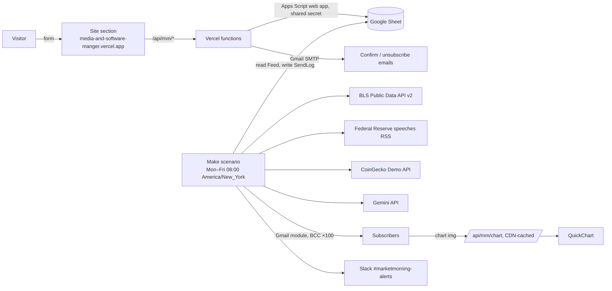
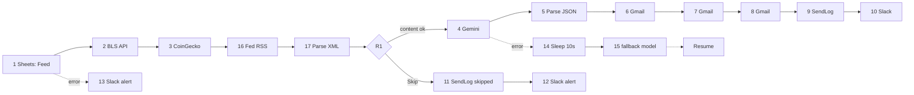

# MarketMorning architecture

Portfolio demo, not financial advice. Sheet: [SHEET.md](SHEET.md). Data licensing: [DATA-SOURCES.md](DATA-SOURCES.md). Build steps: [BUILD-ORDER.md](BUILD-ORDER.md), [IMPORT.md](IMPORT.md) (blueprint import), [MAIA-PROMPTS.md](MAIA-PROMPTS.md) (fallback).

## 1. System

A **Fed, US data and crypto** brief. There are no stock prices or market headlines: no free source licenses showing them, and GDELT was unreachable from every network tested (DATA-SOURCES.md). Signups never touch Make. Gemini and Slack never receive subscriber data; Make reads only the BCC lists.

## 2. Make scenario (one scenario)

**Schedule:** Weekdays (Mon–Fri), 08:00, organization time zone America/New_York (DST-aware; runs on market holidays too).

**Reference build note:** in the reference scenario ID 1 was consumed by a deleted placeholder, so every **Make ID = label number + 1** ("1 Read Feed" = ID 2 … "17 Parse Fed RSS" = ID 18; routers/directives ≥ 19). The table below lists modules by **label number**; all mappings (template, prompts, MAIA-PROMPTS pastes) use the real Make IDs.

**Creation order fixes the IDs** (routers and directives take IDs too):
- **Phase A** creates only modules 1–12 as a plain chain, then:
  - **13** = Slack alert on module 1's error route;
  - **14** = Tools › Sleep;
  - **15** = Gemini with the fallback model;
  - **16** = HTTP Fed RSS and **17** = XML › Parse XML, inserted on the link 3 → 4;
- **Phase B** adds router R1 (no R2: 6 → 10 stays a chain, C13b), all directives and filters, and rewires. They take IDs ≥ 19, which nothing maps.
- JSON › Create JSON (only if check C6 fails) takes the next free ID.

**Scenario settings:** Data is confidential: on (off during testing, so run logs show data); max cycles 1; sequential processing off; storing incomplete executions off. HTTP modules 2, 3, 4, 15, 16: Evaluate all states as errors: Yes. `FED` = `ifempty(18.rss.channel[1].item; emptyarray)`, written out inline.

| ID | Module | Key settings and mappings | Error handler | Credits |
|---|---|---|---|---|
| 1 | Google Sheets › Get range values | `Feed!A2:L2`, table contains headers: **No** (with `A1:L2` + headers Make also emits the header row as a bundle, so everything ran twice; 2026-10-06). Make keys the output by **column number** (header names are only labels): 0 send_enabled, 1 gemini_model, 2 fallback_json, 3 active_count, 4 batch_count, 5–7 batch_1–3, 8 site_url, 9 owner_email, 10 fallback_summary, 11 gemini_fallback_model; mapped as `` {{2.`8`}} `` | 13 Slack "MarketMorning FAILED: Sheet read: {{error.message}}" → **Ignore** (13 also gets its own Ignore handler) | 1 (+1) |
| 2 | HTTP › Make a request | POST `https://api.bls.gov/publicAPI/v2/timeseries/data/`; body content type application/json, JSON string = `prompts/bls-request.make.json` with the BLS key typed into `registrationkey` **in Make only** (the key only works in the body, so no keychain); header `User-Agent: MarketMorning portfolio demo`; parse: Yes; timeout 20 s. Returns CPI, unemployment rate, payrolls, PPI (latest, with 1-month calculations), in that order | **Resume**, `data` empty | 1 |
| 3 | HTTP › Make a request | GET `https://api.coingecko.com/api/v3/simple/price?ids=bitcoin,ethereum,solana,ripple,binancecoin,dogecoin&vs_currencies=usd&include_24hr_change=true&include_last_updated_at=true`; keychain "CoinGecko" (header `x-cg-demo-api-key`); parse: Yes; timeout 20 s | **Resume**, `data` empty | 1 |
| 16 | HTTP › Make a request | GET `https://www.federalreserve.gov/feeds/speeches.xml`; header `` User-Agent: MarketMorning portfolio demo ({{2.`8`}}) ``; parse: No; timeout 20 s | **Resume**, `data` empty | 1 |
| 17 | XML › Parse XML | XML `{{17.data}}` (`{{toString(17.data)}}` if it arrives as binary, C23); data structure generated from `samples/fed-speeches.sample.xml` | **Resume**, empty | 1 |
| R1 | Router | Route A "Content OK" (one AND group): `` 2.`0` `` Text = `TRUE` **and** `{{length(FED) + if(4.data.bitcoin.usd; 1; 0) + if(3.data.Results.series[1].data[1].value; 1; 0)}}` Numeric > `0`. Route B "Skip" = the inverse as two OR groups (`` 2.`0` `` Text ≠ `TRUE` / count Numeric = 0); the blueprint import uses this, the Maia build may tick "Fallback route" instead | – | 0 |
| 4 | HTTP › Make a request | POST `` https://generativelanguage.googleapis.com/v1beta/models/{{2.`1`}}:generateContent ``; keychain "Gemini" (header `x-goog-api-key`); JSON-string body = `prompts/gemini-body.make.txt` (generated, §3.2); parse: Yes; timeout 60 s | 14 Sleep 10 s → **15** (clone of 4 with `` {{2.`11`}} ``, timeout 40 s) → **Resume** with `data` = `{{16.data}}`; 15's handler: **Resume**, `data` empty | 1 (+2) |
| 5 | JSON › Parse JSON | `` {{ifempty(5.data.candidates[1].content.parts[1].text; 2.`2`)}} ``; data structure `source`, `summary`, `crypto_note` | **Resume**: `source`=fallback, `summary`=`` {{2.`10`}} ``, `crypto_note` empty | 1 |
| 6–8 | Gmail › Send an email (chained, no filters: C13b; an empty batch mails the owner only) | To `` {{2.`9`}} ``; BCC (map) `` {{split(2.`5`/`6`/`7`; ",")}} ``; Subject `MarketMorning · {{formatDate(now; "ddd, MMM D"; "America/New_York")}}: the Fed, US data and crypto`; Raw HTML = [templates/digest-email.html](../templates/digest-email.html); header `` List-Unsubscribe: <{{2.`8`}}/unsubscribe> `` | **Resume** | 1 each |
| 9 | Sheets › Add a row | SendLog: date, `` {{2.`3`}} ``, `SENT`, `STATUS`, `ERR` (full strings in `tools/build-blueprint.mjs`) | Resume | 1 |
| 10 | Slack › Create a message | `` MarketMorning STATUS: attempted {{2.`3`}} subscribers, SENT/{{2.`4`}} batches delivered. ERR `` | Ignore | 1 |
| 11 | Sheets › Add a row | SendLog: date, `` {{2.`3`}} ``, 0, `skipped`, `send disabled or no content` | Resume | 1 |
| 12 | Slack › Create a message | `MarketMorning SKIPPED: SEND_ENABLED off, or the Fed feed, BLS and CoinGecko all empty.` | Ignore | 1 |

Inline expressions (Gmail "message ID" output shown as `7.id`):
- `SENT` = `` if(7.id; 1; 0) + if(2.`4` < 2; 0; if(8.id; 1; 0)) + if(2.`4` < 3; 0; if(9.id; 1; 0)) `` (only batches that exist)
- `STATUS` = `` if(2.`4` = 0; "ok"; if(SENT = 0; "failed"; if(SENT < 2.`4`; "partial"; if(6.source = "fallback"; "ok_no_ai"; "ok")))) ``
- `ERR` = "AI fallback. " / "No BLS data. " (`3.data.Results.series[1].data[1].value` empty) / "No crypto data. " / "No Fed feed. " / "Batch failures. ", as applicable (full strings in `tools/build-blueprint.mjs`; module 10 uses the same ERR).

## 3. Data contracts
### 3.1 Sheet tabs (formulas in SHEET.md)
| Tab | Columns | Writer |
|---|---|---|
| Config | key, value: SEND_ENABLED, SUBSCRIBER_CAP=300, BATCH_SIZE=100, TX_CONFIRM_CAP=70, TX_UNSUB_CAP=30, GEMINI_MODEL, GEMINI_FALLBACK_MODEL, SITE_URL, OWNER_EMAIL, FALLBACK_SUMMARY | Owner |
| Subscribers | email, status, created_at, confirmed_at, unsubscribed_at, token_nonce | Vercel |
| TxLog | sent_at, type, email_hash | Vercel |
| SendLog | date, subscribers, batches, status, error | Make |
| Feed | 12 computed keys (A–L) | Formulas |
| Dashboard | counts, tables, 3 charts | Formulas |

### 3.2 Gemini request (no subscriber data)
The raw body is **generated** by `node tools/preview-digest.mjs --make-body` from `prompts/digest.system.md` + `prompts/gemini-user.make.txt` + `prompts/digest.schema.json`. Make and the local preview therefore send identical requests. The user template has three sections:
- **FED SPEECHES:** up to 3 dated lines.
- **LATEST US DATA:** 4 BLS lines (label | value with month).
- **CRYPTO:** 6 coins, with the as-of time.

Missing items render as empty lines. Fed titles go through `escapeHTML` and back, so `"` becomes `'` and the body stays valid JSON (Make's editor breaks `\"` inside a string, 2026-10-06). A `\` in a title would still break the JSON; Gemini then fails and the fallback summary is sent.

**Output:** `{"summary":"3 sentences: Fed, data, crypto","crypto_note":"…"}`. Feed `fallback_json` has the same keys plus `"source":"fallback"`.

### 3.3 Email sections
- Summary.
- **Latest US economic data:** CPI, unemployment rate, payroll jobs and PPI, each "value in month" verbatim, with a "Source: U.S. Bureau of Labor Statistics" link.
- **From the Federal Reserve:** latest 3 speeches with dates and links, "Source: Federal Reserve Board", and a not-affiliated note.
- **Crypto:** table, chart and "Powered by CoinGecko".
- Footer.

Each section, its footer credit and the "Summary written by AI…" line appear only when true.

## 4. Site and Vercel functions
Spec in [SITE.md](SITE.md):
- `POST /api/mm/subscribe`
- `GET|POST /api/mm/confirm`
- `GET /unsubscribe`, `POST /api/mm/unsubscribe`
- `GET|POST /api/mm/unsubscribe/confirm`
- `GET /api/mm/chart`

Tokens are HMAC-signed, expiring and single-use, and state changes only on POST. Abuse controls: honeypot, MX check, WAF rate limit and rolling email budgets. The functions read and write the Sheet through an Apps Script web app bound to it (`tools/site-sheet-api.gs`: fixed operations, shared secret, plain-text writes), so no Google Cloud project is needed. The chart proxy renders QuickChart once per CDN region and serves a placeholder for anything invalid.

## 5. Budgets
**Credits per run:**
- Normal: 1 + 1 (BLS) + 1 + 2 (Fed 16–17) + 1 + 1 + 3 + 1 + 1 = **12**.
- Worst: 12 + Gemini retry (14, 15) 2 + Create JSON (next free ID, check C6) 1 = **15**.
- Skipped run: 7. Sheet failure: 2.

**Per month (max 23 weekdays):** worst 15 × 23 = **345 ≤ 400**; typical 12 × 22 = 264.

**Testing:** ≤ 150 credits (plan in MAIA-PROMPTS Step 8). Go live in the month after testing, so live + test stays ≤ 400 (exception: October 2026, own account, see BUILD-ORDER §7).

Gmail, not credits, limits the subscriber count. **Runtime** worst case ≈ 20 × 3 (2, 3, 16) + 60 (4) + 10 (14) + 40 (15) + ~30 ≈ 3.3 min, under Make Free's 5-min limit (check C15).

**Gmail** (personal: 500 recipients/message, 500 per rolling 24 h; every recipient counted):
- Digest = N + ⌈N/100⌉ owner copies; N = 300 gives 303.
- Transactional ≤ 100 per rolling 24 h. Peak 403, leaving ~95 for the owner.
- Hence **SUBSCRIBER_CAP 300, BATCH_SIZE 100**.

**Other services:**
- **CoinGecko Demo** (10,000 calls/month): ~23 calls plus tests.
- **BLS, Fed:** 1 request each per run.
- **QuickChart** (free ≈ 60/min, 1,000/month): the proxy URL is unique per day and immutable, so renders ≈ CDN misses, about 460/month.

## 6. Error handling
| Call | Failure | Behaviour |
|---|---|---|
| Sheets read (1) | API error | Slack alert; no send, no SendLog (documented exception to FR13). |
| BLS API (2) | error, 403, `REQUEST_NOT_PROCESSED` (e.g. daily limit) | `3.data.Results.series[1].data[1].value` empty → data section and credit hidden; summary covers the Fed and crypto. |
| CoinGecko (3) | error / 429 | "Crypto prices unavailable today."; table, chart and credit hidden; `crypto_note` empty. |
| Fed RSS (16) / Parse XML (17) | error, non-XML | Empty `FED` → Fed section hidden. |
| BLS, CoinGecko and Fed all empty, or SEND_ENABLED off | – | Route B: SendLog `skipped` + Slack. |
| Gemini (4) | 429/503/timeout/4xx | Sleep 10 s (14), then retry once with `GEMINI_FALLBACK_MODEL` (15). If that fails too, module 5 uses `fallback_json`: status `ok_no_ai`, and the footer says the summary was not written by AI. If Make can't attach a handler to 15 (C14b), 15 runs with "Evaluate all states as errors: No". |
| Gemini output (5) | bad/truncated JSON | Resume with fallback fields. |
| Gmail (6–8) | any error | Resume; other routes still run; `partial`/`failed`; Slack shows it. |
| SendLog/Slack | error | Resume/Ignore. |
| Vercel → Sheets / SMTP | error | 500 or `?mm=error` / same 200 (no status leak); see SITE.md. |
| QuickChart | 429/5xx | Placeholder PNG, 5-min cache; alt text. |

## 7. Decisions
| Decision | Source | Status |
|---|---|---|
| No stock prices: no free stock API licenses third-party display | [DATA-SOURCES.md](DATA-SOURCES.md) | Decided |
| No market headlines: no free news API licenses display; GDELT unreachable from Make, Google and local networks (2026-10-05) | [DATA-SOURCES.md](DATA-SOURCES.md) | Decided (owner: "Fed, no paid APIs") |
| Official data from the BLS Public Data API v2 (free key; RSS feed is blocked from Make by BLS bot protection). Cite the retrieval date and BLS's "cannot vouch" statement; no BLS logo | [24], [26] | Decided (C25) |
| Fed speeches RSS (public domain, cite the Board, no seal) | [25], [27] | Decided (C22, C23) |
| Crypto from CoinGecko Demo API with "Powered by CoinGecko" + logo + link | [1], [2], [3] | Decided |
| BEA not used: +2 credits would exceed 400/month worst case | – | Decided |
| Org time zone America/New_York; schedule Weekdays 08:00 | [7], [8] | Decided |
| Make Free: 2 active scenarios, 1,000 credits, 5-min max run | [9] | Decided |
| Routers and error-handler activation free; no iterators/aggregators | [10] | Decided |
| Models = `GEMINI_MODEL` + `GEMINI_FALLBACK_MODEL`; `generateContent` + `responseMimeType` + `responseJsonSchema` | [11], [12] | Decided (C6, C7) |
| Free-tier prompts may be used by Google → only public data sent | [13] | Decided |
| Gmail 500/day, 500/message → cap 300, batch 100 | [14] | Decided |
| Make Gmail: BCC + additional headers → `List-Unsubscribe` (URL only) | [15] | Decided (C8) |
| Make Gmail and Sheets via Make's built-in Google sign-in; reauth every 6 months | [16] | Decided |
| Vercel → Sheet via an Apps Script web app (owner: no Google Cloud project) | [17] | Decided |
| Transactional mail: nodemailer, smtp.gmail.com:465, app password | [18] | Decided (C10) |
| Chart via immutable, CDN-cached proxy | [19], [20], [21] | Decided (C16) |
| Confirm/unsubscribe change state only on POST | owner choice (prevents link-scanner prefetch) | Decided |
| Per-IP limit via Vercel WAF rate-limit rule (Hobby: 1 rule) | [22] | Decided (C11) |
| API keys in Make API-key keychains, not in the blueprint | [23] | Decided |
| New Slack channel #marketmorning-alerts | owner choice | Decided |

Refs [4]–[6] and checks C3–C5, C12 were retired with the headline design. [1] coingecko.com/en/api_terms · [2] coingecko.com/en/api/pricing · [3] brand.coingecko.com/resources/attribution-guide · [7] help.make.com/manage-time-zones · [8] help.make.com/schedule-a-scenario · [9] make.com/en/pricing · [10] help.make.com/how-features-use-credits · [11] ai.google.dev/gemini-api/docs/models · [12] ai.google.dev/api/generate-content · [13] ai.google.dev/gemini-api/docs/pricing · [14] support.google.com/mail/answer/22839 · [15] apps.make.com/gmail-modules · [16] apps.make.com/google-email · [17] developers.google.com/apps-script/guides/web · [18] support.google.com/mail/answer/185833 · [19] quickchart.io/pricing · [20] community.quickchart.io/t/rate-limits-for-quickchart-free-plan/722 · [21] vercel.com/docs/caching/cdn-cache · [22] vercel.com/docs/vercel-firewall/vercel-waf/rate-limiting · [23] apps.make.com/api-key-authentication-type · [24] bls.gov/developers/api_signature_v2.htm · [25] federalreserve.gov/feeds/feeds.htm · [26] bls.gov/developers/termsOfService.htm · [27] federalreserve.gov/disclaimer.htm
